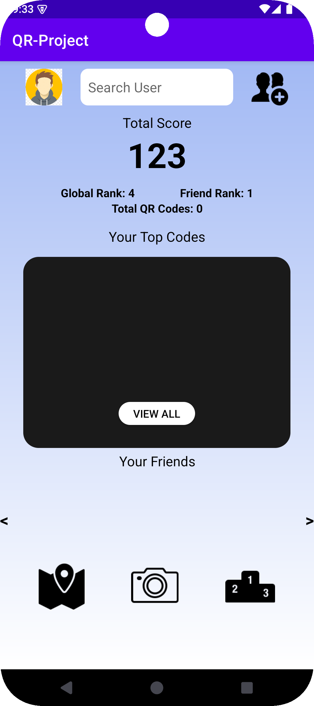
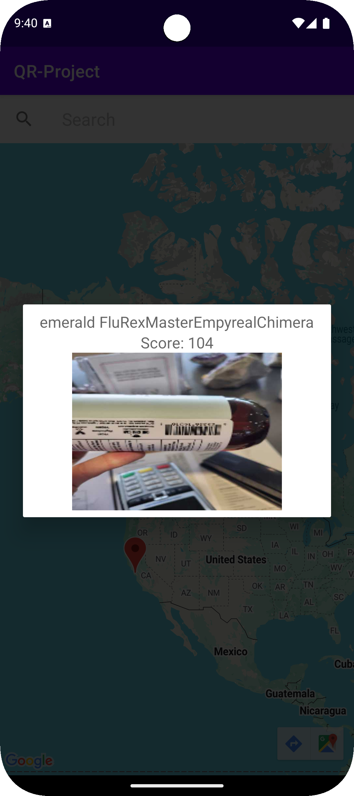
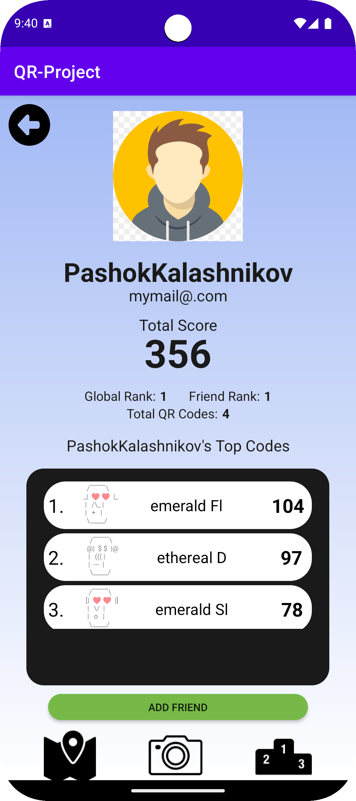
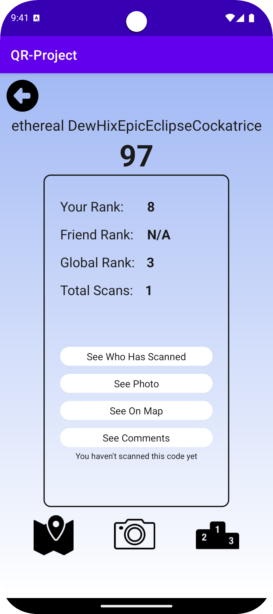
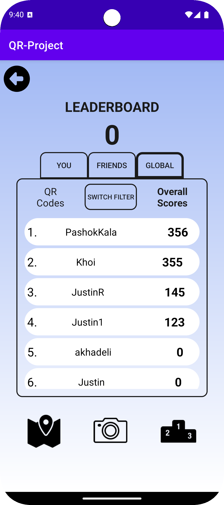

# QR-Project

QR-Project is an Android application that allows users to scan, collect, and interact with QR codes in a gamified environment. Users can create accounts, scan QR codes to generate unique digital collectibles, view leaderboards, add friends, comment on QR codes, and explore QR code locations on a map.

## Features

- **User Accounts:** Sign up and log in with a unique username, email, and phone number.
- **QR Code Scanning:** Scan physical QR codes to generate unique digital representations with custom names, faces, and scores.
- **Leaderboard:** Compete with friends and globally by collecting high-scoring QR codes.
- **Friends System:** Add friends, view their profiles, and compare scores.
- **Comments:** Leave comments on QR codes and view comments from other users.
- **Map Integration:** Visualize the locations where QR codes were scanned.
- **Profile Management:** View and manage your collection of QR codes and personal statistics.

## Screenshots







## Getting Started

### Prerequisites

- Android Studio (latest version recommended)
- Android device or emulator
- Java 8 or higher
- Internet connection (for Firebase integration)

### Build and Run

1. **Clone the repository:**
   ```sh
   git clone <repository-url>
   cd QR-Project
     ```
2. **Open the project in Android Studio.**
   - Launch Android Studio.
   - Select "Open an existing Android Studio project" and navigate to the cloned repository.
   - Click "OK" to open the project.

3. **Sync Gradle**
   - Click on "Sync Now" in the notification bar that appears.
   - Wait for the Gradle build to finish.

4. **Run the app**
   - Connect your Android device or start an emulator.
   - You can build and run the app on an emulator or a connected Android device using the following Gradle command:
   ```sh
     ./gradlew installDebug
     ```
     - Alternatively, you can run the app directly from Android Studio by clicking the "Run" button.

## Project Structure
- app - Main Android application source code, resources, and tests.
- doc - Documentation and team information.
- gradle - Gradle wrapper files for build automation.

## Team Members
- Abdullah Khadeli (akhadeli)
- Aksshat Khanna (aksshat)
- Justin Robertson (jtrober1)
- Khoi Le (phuocngu)
- Luke Wismer (lwismer)
- Paul Startsev (pstartse)
